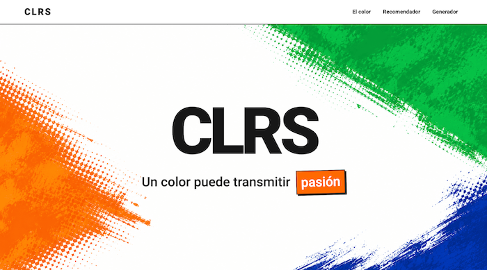

# CLRS

**Generador interactivo de paletas de colores**

CLRS es una aplicación web estática e interactiva desarrollada como Proyecto Integrador del Módulo 1 del bootcamp Full Stack Web de Henry.

La aplicación permite explorar el impacto del color, recibir recomendaciones visuales según diferentes industrias y generar paletas de colores aleatorias en formatos HEX y HSL.

---

## Demo

🔗 [Ver CLRS en GitHub Pages](https://junotquiroz.github.io/ProyectoM1_JunotQuiroz/)

---

## Vista previa



---

## Funcionalidades

CLRS integra distintas herramientas orientadas a explorar y trabajar con el color:

- **Generación de paletas aleatorias:** permite crear nuevas combinaciones de colores mediante un botón principal.
- **Selección de tamaño:** el usuario puede generar paletas de 6, 8 o 9 colores.
- **Formatos HEX y HSL:** cada color puede visualizarse en cualquiera de los dos formatos.
- **Cambio de formato sin perder la paleta:** al alternar entre HEX y HSL se conservan los mismos colores y únicamente cambia su representación.
- **Copiado al portapapeles:** al hacer clic sobre una tarjeta de color se copia automáticamente el código visible.
- **Microfeedback visual:** después de copiar un color, la aplicación muestra un mensaje de confirmación.
- **Recomendador por industria:** permite seleccionar un sector y recibir una recomendación acompañada de tres colores sugeridos.
- **Hero dinámico:** diferentes palabras relacionadas con las emociones y sensaciones del color cambian automáticamente.
- **Renderizado dinámico con JavaScript:** las tarjetas de color son creadas en tiempo real según las opciones seleccionadas.
- **Diseño responsive:** la interfaz adapta su distribución para diferentes tamaños de pantalla.
- **Consideraciones de accesibilidad:** se utilizan etiquetas semánticas, labels asociados, foco visible, botones accesibles y regiones `aria-live`.

---

## Tecnologías utilizadas

| Tecnología | Uso en el proyecto |
|---|---|
| HTML5 | Estructura semántica de la aplicación |
| CSS3 | Diseño visual, Flexbox, Grid y responsive design |
| JavaScript | Lógica, eventos, DOM y generación dinámica de contenido |
| Git | Control de versiones |
| GitHub | Repositorio y documentación |
| GitHub Pages | Despliegue de la aplicación |
| Markdown | Documentación del proyecto |

---

## Estructura del proyecto

```text
ProyectoM1_JunotQuiroz/
│
├── index.html
├── styles.css
├── script.js
├── README.md
│
└── assets/
    ├── hero-background.png
    └── captura-clrs.png

---

## Cómo usar CLRS

1. Selecciona una industria en el recomendador para consultar una sugerencia de color.
2. Dirígete al generador de paletas.
3. Elige si deseas generar 6, 8 o 9 colores.
4. Selecciona el formato HEX o HSL.
5. Presiona **Generar paleta**.
6. Haz clic sobre cualquier color para copiar su código al portapapeles.
7. Cambia entre HEX y HSL para visualizar la misma paleta en ambos formatos.

---

## Decisiones técnicas

### Generación y representación del color

Los colores se generan a partir de valores HSL aleatorios. Cada color se almacena como un objeto de JavaScript que contiene tanto su representación HSL como su equivalente en HEX.

Esto permite alternar entre ambos formatos sin generar una nueva paleta.

### Render dinámico

Las tarjetas de color no están escritas directamente en el HTML.

JavaScript crea cada tarjeta dinámicamente con `document.createElement()` de acuerdo con la cantidad seleccionada por el usuario.

### Selección de cantidad

La elección entre 6, 8 o 9 colores utiliza controles `radio`, ya que solo puede existir una opción activa al mismo tiempo.

### Copiado al portapapeles

Cada tarjeta de color funciona como un botón interactivo. Al hacer clic, el código visible se copia mediante la Clipboard API y se muestra un mensaje de confirmación.

### Separación de responsabilidades

El proyecto mantiene una separación clara entre tecnologías:

- HTML: estructura y semántica.
- CSS: apariencia, distribución y responsive design.
- JavaScript: comportamiento, eventos y manipulación del DOM.